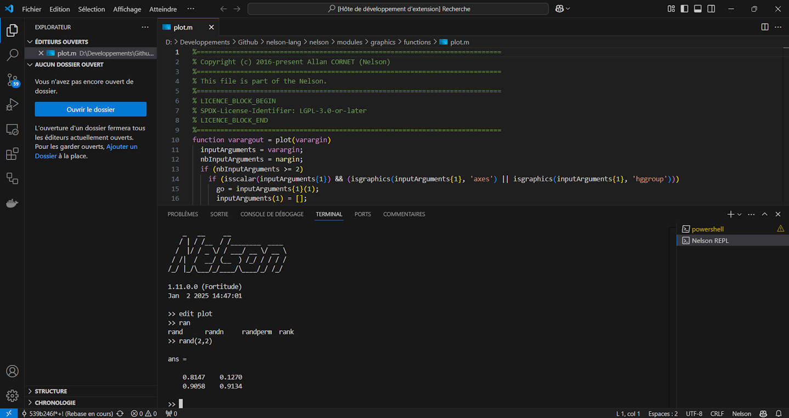
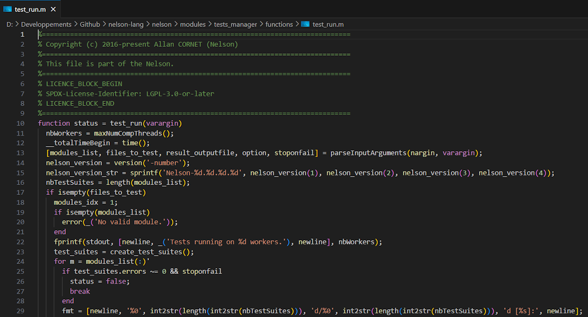
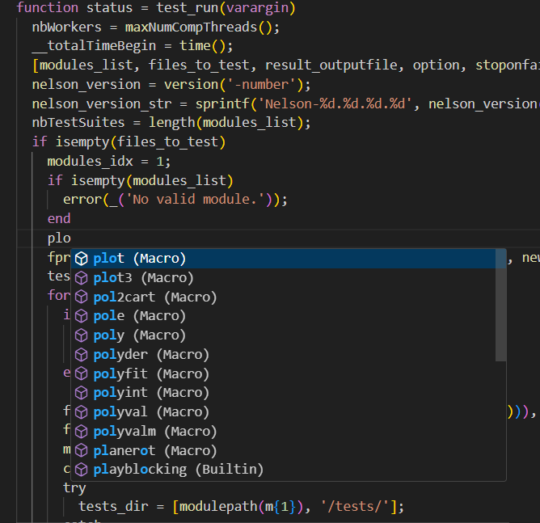
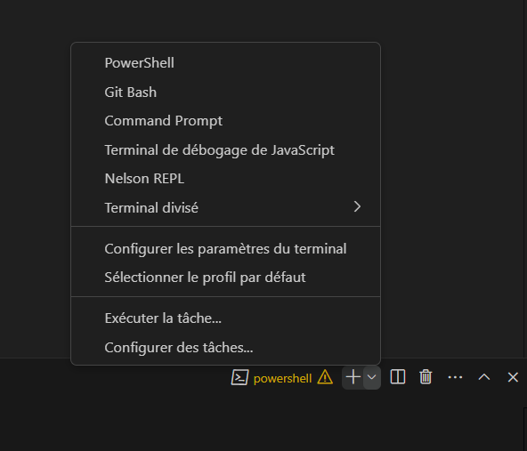

# Nelson for Visual Studio Code 🚀

This extension adds support for Nelson to VS Code, including Snippets and Syntax highlighting.

More information about [Nelson](https://github.com/Nelson-lang/nelson).

## Features ✨

### The extension provides Nelson features without installing the Nelson language

- Syntax highlighting 🎨

  

- Declarative language features:

  

  - Comments 💬
  - Brackets 🔧
  - Indentation rules 📏
  - Collapsible/folding 📂
  - Auto-completion ⚡

### Advanced Features requiring Nelson language installed

- Terminal profile 🖥️

  

  Make sure the path to the Nelson executable is added to either the PATH environment variable or the NELSON_RUNTIME_PATH environment variable. On Windows, starting with version 1.11, NELSON_RUNTIME_PATH is automatically configured during installation.

## Known Issues 🐞

Feel free to consult and create bug or feature reports [here](https://github.com/nelson-lang/nelson-vscode/issues).

## Release Notes 📝

See [Changelog](https://github.com/nelson-lang/nelson-vscode/blob/master/CHANGELOG.md).

## Author 👤

Allan CORNET (<nelson.numerical.computation@gmail.com>)
